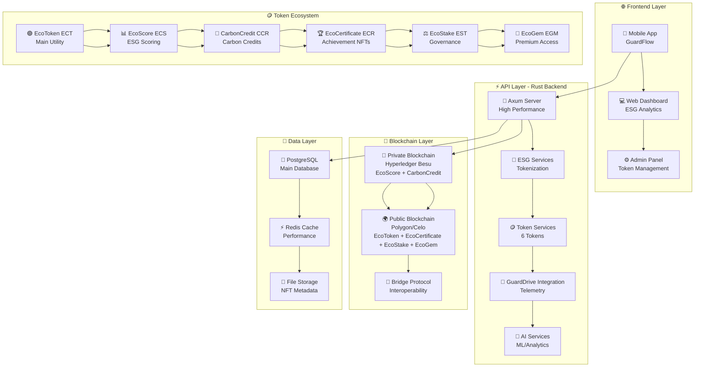
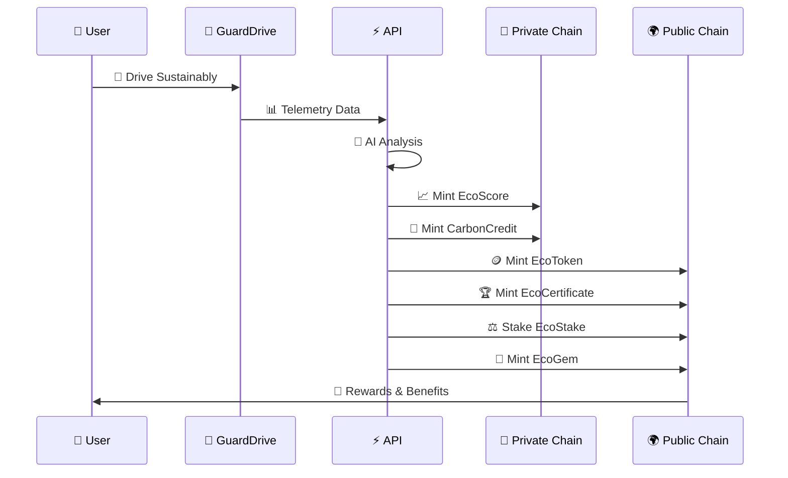
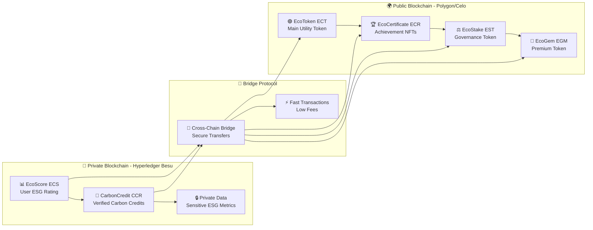
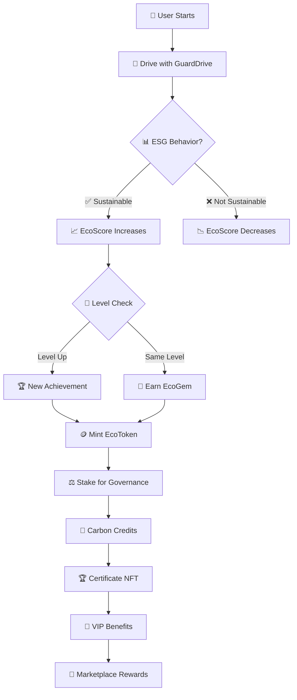
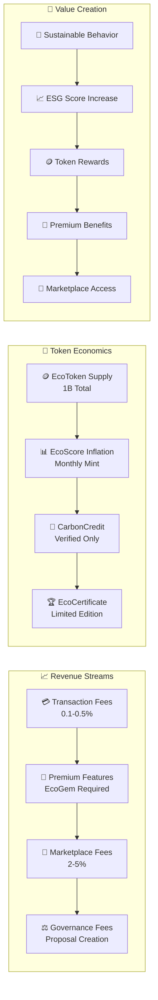
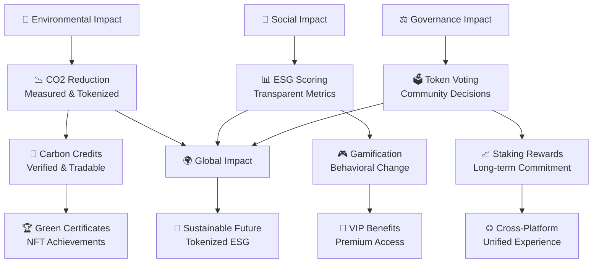
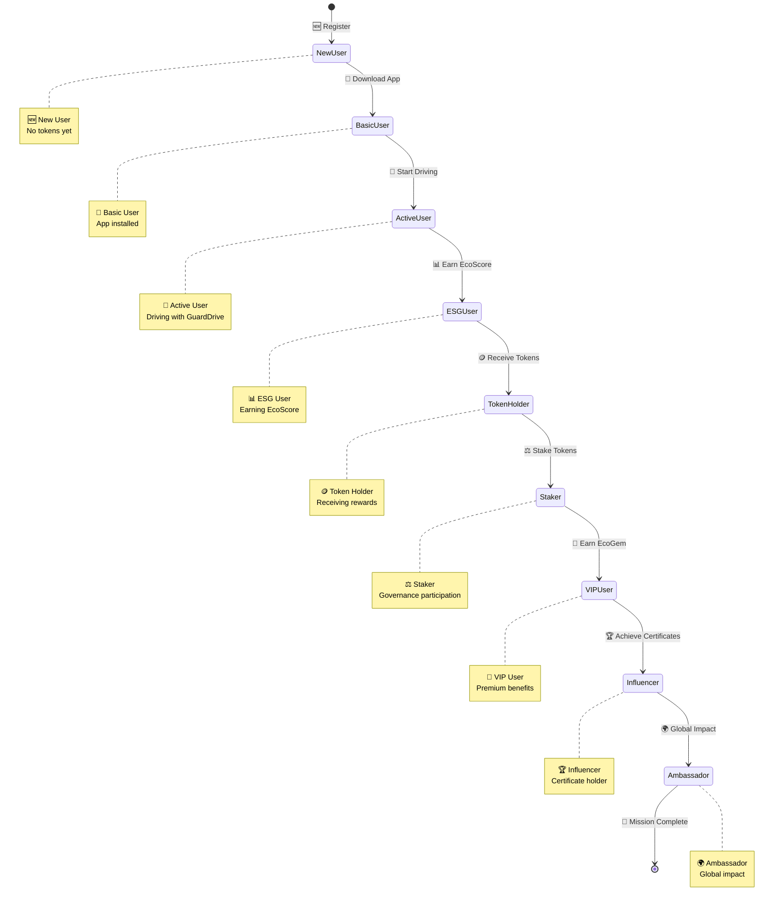

# 🎨 ECOTOKEN HYBRID ECOSYSTEM - DIAGRAMAS

## 📊 **DIAGRAMA ARQUITETURAL COMPLETO**

## 🔄 **FLUXO DE TOKENIZAÇÃO ESG**

## 🏗️ **ARQUITETURA DE BLOCKCHAIN HÍBRIDA**

## 🎮 **SISTEMA DE GAMIFICAÇÃO**

## 🔌 **API ENDPOINTS ARCHITECTURE**

```mermaid
graph TB
    subgraph "🪙 EcoToken ECT"
        A1[GET /ect/info] --> A2[GET /ect/balance]
        A2 --> A3[POST /ect/transfer]
        A3 --> A4[POST /ect/stake]
    end
    
    subgraph "📊 EcoScore ECS"
        B1[GET /ecs/profile] --> B2[POST /ecs/mint]
        B2 --> B3[GET /ecs/benefits]
        B3 --> B4[GET /ecs/levels]
    end
    
    subgraph "🌿 CarbonCredit CCR"
        C1[GET /ccr/balance] --> C2[POST /ccr/mint]
        C2 --> C3[GET /ccr/marketplace]
        C3 --> C4[POST /ccr/buy]
    end
    
    subgraph "🏆 EcoCertificate ECR"
        D1[POST /ecr/mint] --> D2[GET /ecr/certificates]
        D2 --> D3[GET /ecr/verify]
        D3 --> D4[POST /ecr/buy]
    end
    
    subgraph "⚖️ EcoStake EST"
        E1[GET /est/position] --> E2[POST /est/stake]
        E2 --> E3[GET /est/rewards]
        E3 --> E4[GET /est/tiers]
    end
    
    subgraph "💎 EcoGem EGM"
        F1[GET /egm/balance] --> F2[POST /egm/mint]
        F2 --> F3[GET /egm/vip-status]
        F3 --> F4[POST /egm/access-feature]
    end
    
    subgraph "🌐 Ecosystem"
        G1[GET /ecosystem/balance] --> G2[POST /ecosystem/transfer]
        G2 --> G3[GET /ecosystem/stats]
    end
```

## 💰 **MODELO ECONÔMICO**

## 🌍 **IMPACTO ESG**

## 🔄 **CICLO DE VIDA DO USUÁRIO**

---

## 📊 **MÉTRICAS DE SUCESSO**

### **KPIs Técnicos:**
- ⚡ **Performance**: 100.000+ requests/segundo
- 🔒 **Security**: 99.9% uptime
- 📊 **Scalability**: Suporte a 1M+ usuários
- 🌐 **Interoperability**: 6 tokens integrados

### **KPIs ESG:**
- 🌱 **Carbon Reduction**: CO₂ evitado tokenizado
- 📈 **User Engagement**: Tempo médio na plataforma
- 🎯 **Behavior Change**: % de usuários mais sustentáveis
- 💰 **Economic Impact**: Valor total em tokens

### **KPIs de Negócio:**
- 💳 **Revenue**: Taxas de transação
- 👥 **User Growth**: Novos usuários/mês
- 🔄 **Retention**: Taxa de retenção
- 🌍 **Global Reach**: Países ativos

---

*Diagramas criados para o EcoToken Hybrid Ecosystem v1.0*  
*Status: Implementação Completa ✅*

