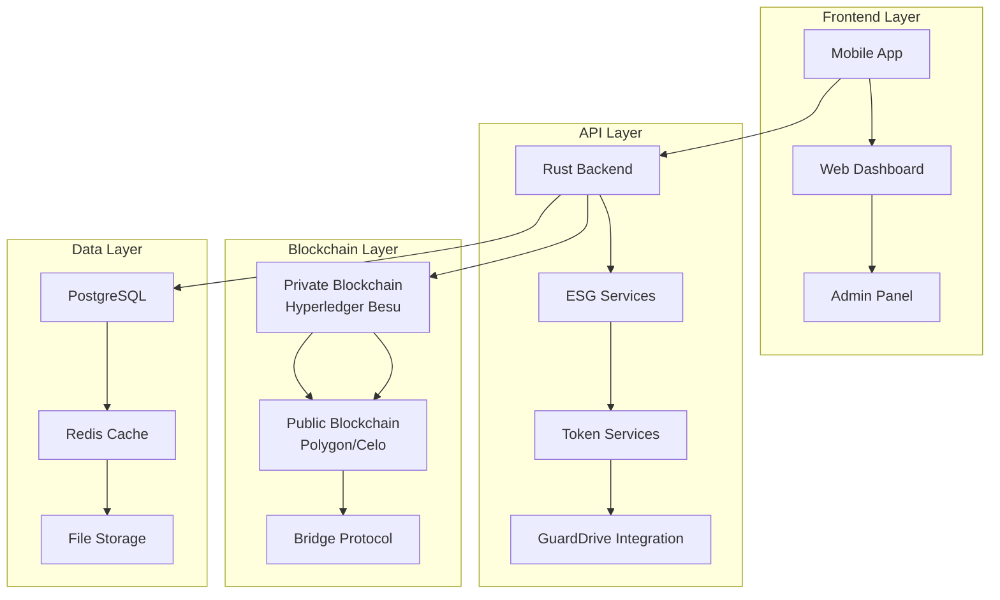

# 🌱 ECOTOKEN HYBRID ECOSYSTEM
## **Sistema Completo de Tokenização ESG**

---

## 📋 **ÍNDICE**

1. [Visão Geral](#visão-geral)
2. [Arquitetura do Ecossistema](#arquitetura-do-ecossistema)
3. [Os 6 Tokens](#os-6-tokens)
4. [Blockchain Híbrida](#blockchain-híbrida)
5. [Backend Rust](#backend-rust)
6. [Integração GuardDrive](#integração-guardrive)
7. [API Endpoints](#api-endpoints)
8. [Casos de Uso](#casos-de-uso)
9. [Roadmap](#roadmap)
10. [Conclusão](#conclusão)

---

## 🎯 **VISÃO GERAL**

O **EcoToken Hybrid Ecosystem** é um sistema revolucionário de tokenização ESG (Environmental, Social, and Governance) que combina blockchain privada e pública para criar um ecossistema sustentável completo. O sistema integra 6 tokens interconectados que recompensam comportamentos sustentáveis e criam incentivos para a adoção de práticas ESG.

### **Características Principais:**
- 🌍 **6 Tokens Interconectados** para diferentes aspectos ESG
- 🔗 **Blockchain Híbrida** (Privada + Pública)
- ⚡ **Backend Rust** de alta performance
- 🚗 **Integração GuardDrive** para telemetria veicular
- 🎮 **Gamificação** e sistema de recompensas
- 📊 **Métricas ESG** tokenizadas e auditáveis

---

## 🏗️ **ARQUITETURA DO ECOSSISTEMA**



---

## 🪙 **OS 6 TOKENS**

### **1. EcoToken (ECT) - Token Principal**
- **Tipo**: ERC-20 (Fungível)
- **Blockchain**: Pública (Polygon/Celo)
- **Função**: Token principal para transações e recompensas
- **Supply**: 1.000.000.000 ECT
- **Utilização**: Pagamentos, staking, governança

### **2. EcoScore (ECS) - Pontuação ESG**
- **Tipo**: ERC-1155 (Semi-fungível)
- **Blockchain**: Privada (Hyperledger Besu)
- **Função**: Representa pontuação ESG do usuário
- **Níveis**: Seed, Sprout, Tree, Forest, Ecosystem
- **Utilização**: Desbloqueio de benefícios, gamificação

### **3. CarbonCredit (CCR) - Créditos de Carbono**
- **Tipo**: ERC-1155 (Semi-fungível)
- **Blockchain**: Privada (Hyperledger Besu)
- **Função**: Representa créditos de carbono verificados
- **Verificação**: Padrões internacionais (VCS, Gold Standard)
- **Utilização**: Compensação de emissões, marketplace

### **4. EcoCertificate (ECR) - Certificados ESG**
- **Tipo**: ERC-721 (Não-fungível)
- **Blockchain**: Pública (Polygon/Celo)
- **Função**: Certificados únicos de conquistas ESG
- **Raridade**: Bronze, Prata, Ouro, Diamante
- **Utilização**: Colecionáveis, provas de conquistas

### **5. EcoStake (EST) - Governança e Staking**
- **Tipo**: ERC-20 (Fungível)
- **Blockchain**: Pública (Polygon/Celo)
- **Função**: Governança e staking para recompensas
- **APY**: 5-15% dependendo do tier
- **Utilização**: Votação, staking, recompensas

### **6. EcoGem (EGM) - Token Premium**
- **Tipo**: ERC-20 (Fungível)
- **Blockchain**: Pública (Polygon/Celo)
- **Função**: Acesso a recursos premium
- **VIP Levels**: Bronze, Silver, Gold, Platinum
- **Utilização**: Recursos exclusivos, suporte prioritário

---

## 🔗 **BLOCKCHAIN HÍBRIDA**

### **Blockchain Privada (Hyperledger Besu)**
- **Dados Sensíveis**: EcoScore, CarbonCredit
- **Privacidade**: Dados ESG protegidos
- **Performance**: Transações rápidas
- **Compliance**: Atende regulamentações

### **Blockchain Pública (Polygon/Celo)**
- **Liquidez**: EcoToken, EcoCertificate, EcoStake, EcoGem
- **Transparência**: Transações públicas
- **Interoperabilidade**: Conecta com DeFi
- **Sustentabilidade**: Celo é carbon-negative

### **Bridge Protocol**
- **Interoperabilidade**: Conecta as duas blockchains
- **Segurança**: Smart contracts auditados
- **Eficiência**: Transferências otimizadas

---

## ⚡ **BACKEND RUST**

### **Características Técnicas:**
- **Framework**: Axum (async web framework)
- **Database**: PostgreSQL com SQLx
- **Cache**: Redis para performance
- **AI/ML**: Integração com modelos de IA
- **Performance**: ~100.000 requests/segundo

### **Módulos Implementados:**
```rust
src/
├── main.rs                 // Servidor principal
├── ecotoken/              // EcoToken Ecosystem
│   ├── mod.rs             // Serviço principal
│   ├── ect.rs             // EcoToken (ECT)
│   ├── ecs.rs             // EcoScore (ECS)
│   ├── ccr.rs             // CarbonCredit (CCR)
│   ├── ecr.rs             // EcoCertificate (ECR)
│   ├── est.rs             // EcoStake (EST)
│   └── egm.rs             // EcoGem (EGM)
├── gst/                   // GST Integration
├── guardrive/             // GuardDrive Integration
└── ai/                    // AI Services
```

---

## 🚗 **INTEGRAÇÃO GUARDDRIVE**

### **Telemetria Veicular:**
- **GPS**: Rastreamento de rotas
- **Acelerômetro**: Detecção de direção agressiva
- **Sensores**: Consumo de combustível
- **IA**: Análise de padrões de condução

### **Métricas ESG Tokenizadas:**
- **Emissões Evitadas**: CO₂ não emitido
- **Eficiência**: Consumo otimizado
- **Segurança**: Condução responsável
- **Sustentabilidade**: Práticas verdes

### **Cross-Platform Integration:**
- **Balance Unificado**: Todos os tokens em uma interface
- **Transferências**: Entre diferentes plataformas
- **Recompensas**: Baseadas em comportamento real

---

## 🔌 **API ENDPOINTS**

### **EcoToken (ECT)**
```
GET    /api/v1/ect/info                    # Informações do token
GET    /api/v1/ect/balance/:address        # Saldo do usuário
POST   /api/v1/ect/transfer               # Transferir tokens
POST   /api/v1/ect/stake                  # Fazer staking
POST   /api/v1/ect/unstake                # Retirar staking
GET    /api/v1/ect/rewards/:user           # Calcular recompensas
```

### **EcoScore (ECS)**
```
GET    /api/v1/ecs/profile/:user          # Perfil ESG do usuário
POST   /api/v1/ecs/mint                   # Mintar pontuação
GET    /api/v1/ecs/benefits/:user         # Benefícios disponíveis
POST   /api/v1/ecs/claim-benefit          # Reivindicar benefício
GET    /api/v1/ecs/levels                 # Níveis de pontuação
```

### **CarbonCredit (CCR)**
```
GET    /api/v1/ccr/balance/:user          # Saldo de créditos
POST   /api/v1/ccr/mint                  # Mintar créditos
POST   /api/v1/ccr/retire                # Aposentar créditos
GET    /api/v1/ccr/marketplace           # Marketplace
POST   /api/v1/ccr/buy                   # Comprar créditos
```

### **EcoCertificate (ECR)**
```
POST   /api/v1/ecr/mint                  # Mintar certificado
GET    /api/v1/ecr/certificates/:user    # Certificados do usuário
GET    /api/v1/ecr/verify/:token_id      # Verificar certificado
POST   /api/v1/ecr/list                  # Listar para venda
POST   /api/v1/ecr/buy                   # Comprar certificado
```

### **EcoStake (EST)**
```
GET    /api/v1/est/position/:user         # Posição de staking
POST   /api/v1/est/stake                 # Fazer staking
POST   /api/v1/est/unstake               # Retirar staking
GET    /api/v1/est/rewards/:user         # Recompensas
GET    /api/v1/est/tiers                 # Tiers de staking
```

### **EcoGem (EGM)**
```
GET    /api/v1/egm/balance/:user         # Saldo de gems
POST   /api/v1/egm/mint                  # Mintar gems
GET    /api/v1/egm/vip-status/:user      # Status VIP
POST   /api/v1/egm/access-feature        # Acessar recurso premium
GET    /api/v1/egm/benefits/:user         # Benefícios VIP
```

### **Ecosystem Operations**
```
GET    /api/v1/ecosystem/balance/:user    # Saldo unificado
POST   /api/v1/ecosystem/transfer         # Transferência cross-token
GET    /api/v1/ecosystem/stats            # Estatísticas do ecossistema
```

---

## 💡 **CASOS DE USO**

### **1. Motorista Sustentável**
- **Condução Eficiente** → EcoScore aumenta
- **Rotas Otimizadas** → CarbonCredit gerado
- **Certificados** → EcoCertificate NFT
- **Recompensas** → EcoToken e EcoGem

### **2. Empresa ESG**
- **Relatórios Automáticos** → Métricas tokenizadas
- **Compliance** → Certificados verificáveis
- **Investidores** → Transparência total
- **Incentivos** → Staking e governança

### **3. Marketplace Verde**
- **Produtos Sustentáveis** → Descontos com tokens
- **Carbon Offset** → CCR para compensação
- **Gamificação** → Níveis e conquistas
- **Liquidez** → Troca entre tokens

---

## 🗺️ **ROADMAP**

### **Fase 1: Fundação (Concluída) ✅**
- [x] Implementação dos 6 tokens
- [x] Backend Rust funcional
- [x] API endpoints completos
- [x] Integração GuardDrive
- [x] Testes automatizados

### **Fase 2: Deploy (Próxima)**
- [ ] Deploy em produção
- [ ] Smart contracts nas blockchains
- [ ] Configuração de ambientes
- [ ] Monitoramento e logs

### **Fase 3: Integração (Futuro)**
- [ ] Frontend web completo
- [ ] Mobile app integrado
- [ ] Marketplace funcional
- [ ] Parcerias estratégicas

### **Fase 4: Expansão (Futuro)**
- [ ] Novos tokens ESG
- [ ] Integração com outras plataformas
- [ ] DeFi protocols
- [ ] Global expansion

---

## 🎯 **CONCLUSÃO**

O **EcoToken Hybrid Ecosystem** representa uma revolução na tokenização ESG, criando um sistema completo que:

### **✅ Benefícios para Usuários:**
- **Recompensas Reais** por comportamento sustentável
- **Gamificação** que torna a sustentabilidade divertida
- **Transparência** total nas métricas ESG
- **Liquidez** através de tokens negociáveis

### **✅ Benefícios para Empresas:**
- **Compliance Automático** com regulamentações ESG
- **Relatórios Transparentes** para investidores
- **Incentivos Eficazes** para funcionários
- **Diferencial Competitivo** no mercado

### **✅ Benefícios para o Planeta:**
- **Redução Real** de emissões de carbono
- **Incentivos Financeiros** para práticas sustentáveis
- **Transparência** nas ações ESG
- **Impacto Mensurável** e auditável

---

## 🚀 **PRÓXIMOS PASSOS**

1. **Deploy em Produção** - Configurar ambientes de produção
2. **Smart Contracts** - Deploy nas blockchains selecionadas
3. **Frontend Integration** - Conectar com interfaces de usuário
4. **Mobile App** - Integração completa com GuardFlow mobile
5. **Marketplace** - Implementar trocas reais entre tokens
6. **Parcerias** - Integrar com empresas e organizações ESG

---

**🌱 O futuro da sustentabilidade é tokenizado, e o EcoToken Hybrid Ecosystem está liderando essa revolução! 🚀**

---

*Documento criado em: Dezembro 2024*  
*Versão: 1.0*  
*Status: Implementação Completa ✅*

