# 🪙 GST ECOSYSTEM INTEGRATION
## **GuardFlow Sustainability Token - Sistema Completo**

---

## 📋 **ÍNDICE GST**

1. [Visão Geral GST](#visão-geral-gst)
2. [Arquitetura GST](#arquitetura-gst)
3. [Smart Contracts GST](#smart-contracts-gst)
4. [Integração com EcoToken](#integração-com-ecotoken)
5. [NFe to NFT Conversion](#nfe-to-nft-conversion)
6. [Smart Cart Integration](#smart-cart-integration)
7. [API Endpoints GST](#api-endpoints-gst)
8. [Marketplace GST](#marketplace-gst)
9. [Gamificação GST](#gamificação-gst)
10. [Governança GST](#governança-gst)

---

## 🎯 **VISÃO GERAL GST**

O **GST (GuardFlow Sustainability Token)** é o token original do ecossistema GuardFlow, agora integrado ao **EcoToken Hybrid Ecosystem** como componente fundamental. O GST funciona como ponte entre o mundo físico (compras, NFe) e o digital (blockchain, tokens).

### **Características GST:**
- 🏪 **Token de Marketplace** para compras sustentáveis
- 🧾 **NFe Tokenization** - Conversão de notas fiscais em NFTs
- 🛒 **Smart Cart Integration** - Carrinho inteligente conectado
- 🎮 **Gamificação** - Sistema de recompensas e missões
- ⚖️ **Governança** - Participação em decisões do ecossistema

---

## 🏗️ **ARQUITETURA GST**

```mermaid
graph TB
    subgraph "🛒 Smart Cart (ESP32)"
        A[📱 Mobile App] --> B[🛒 Smart Cart]
        B --> C[📊 Product Scanner]
        C --> D[🧾 NFe Generator]
    end
    
    subgraph "🪙 GST Token System"
        E[GST Token ERC-20] --> F[GST Marketplace]
        F --> G[GST Gamification]
        G --> H[GST Governance]
    end
    
    subgraph "🌱 EcoToken Integration"
        I[EcoToken ECT] --> J[EcoScore ECS]
        J --> K[CarbonCredit CCR]
        K --> L[EcoCertificate ECR]
    end
    
    subgraph "🔗 Blockchain Layer"
        M[🏢 Private Chain<br/>Hyperledger Besu] --> N[🌍 Public Chain<br/>Polygon/Celo]
    end
    
    D --> E
    E --> I
    I --> M
    M --> N
```



---

## 📜 **SMART CONTRACTS GST**

### **GSTToken.sol - Token Principal**

```solidity
// SPDX-License-Identifier: MIT
pragma solidity ^0.8.19;

import "@openzeppelin/contracts/token/ERC20/ERC20.sol";
import "@openzeppelin/contracts/access/Ownable.sol";
import "@openzeppelin/contracts/security/Pausable.sol";

contract GSTToken is ERC20, Ownable, Pausable {
    uint256 public constant MAX_SUPPLY = 1_000_000_000 * 10**18;
    uint256 public constant INITIAL_SUPPLY = 100_000_000 * 10**18;
    
    // Partner information
    struct Partner {
        address partnerAddress;
        string name;
        uint256 discountPercentage;
        bool active;
        uint256 totalTransactions;
        uint256 totalVolume;
    }
    
    // User profile for GST
    struct UserProfile {
        uint256 totalSpent;
        uint256 totalEarned;
        uint256 loyaltyLevel;
        uint256[] achievements;
        bool isVIP;
    }
    
    mapping(address => Partner) public partners;
    mapping(address => UserProfile) public userProfiles;
    mapping(address => uint256) public partnerDiscounts;
    
    address[] public partnerList;
    uint256 public totalPartners;
    
    event PartnerAdded(address indexed partner, string name, uint256 discount);
    event PartnerUpdated(address indexed partner, uint256 newDiscount);
    event UserProfileUpdated(address indexed user, uint256 loyaltyLevel);
    event GSTEarned(address indexed user, uint256 amount, string reason);
    event GSTSpent(address indexed user, uint256 amount, address partner);
    
    constructor() ERC20("GuardFlow Sustainability Token", "GST") {
        _mint(msg.sender, INITIAL_SUPPLY);
    }
    
    function addPartner(
        address _partner,
        string memory _name,
        uint256 _discountPercentage
    ) external onlyOwner {
        require(_partner != address(0), "Invalid partner address");
        require(_discountPercentage <= 100, "Discount cannot exceed 100%");
        
        partners[_partner] = Partner({
            partnerAddress: _partner,
            name: _name,
            discountPercentage: _discountPercentage,
            active: true,
            totalTransactions: 0,
            totalVolume: 0
        });
        
        partnerList.push(_partner);
        totalPartners++;
        
        emit PartnerAdded(_partner, _name, _discountPercentage);
    }
    
    function earnGST(address user, uint256 amount, string memory reason) external onlyOwner {
        require(user != address(0), "Invalid user address");
        require(amount > 0, "Amount must be greater than 0");
        
        _mint(user, amount);
        userProfiles[user].totalEarned += amount;
        
        emit GSTEarned(user, amount, reason);
    }
    
    function spendGST(address user, uint256 amount, address partner) external {
        require(user != address(0), "Invalid user address");
        require(amount > 0, "Amount must be greater than 0");
        require(partners[partner].active, "Partner not active");
        require(balanceOf(user) >= amount, "Insufficient GST balance");
        
        _burn(user, amount);
        userProfiles[user].totalSpent += amount;
        partners[partner].totalTransactions++;
        partners[partner].totalVolume += amount;
        
        emit GSTSpent(user, amount, partner);
    }
    
    function updateUserProfile(address user) external {
        UserProfile storage profile = userProfiles[user];
        
        // Calculate loyalty level based on total spent
        if (profile.totalSpent >= 10000 * 10**18) {
            profile.loyaltyLevel = 5; // VIP
            profile.isVIP = true;
        } else if (profile.totalSpent >= 5000 * 10**18) {
            profile.loyaltyLevel = 4; // Gold
        } else if (profile.totalSpent >= 1000 * 10**18) {
            profile.loyaltyLevel = 3; // Silver
        } else if (profile.totalSpent >= 100 * 10**18) {
            profile.loyaltyLevel = 2; // Bronze
        } else {
            profile.loyaltyLevel = 1; // Basic
        }
        
        emit UserProfileUpdated(user, profile.loyaltyLevel);
    }
}
```

### **InvoiceNFT.sol - NFe to NFT**

```solidity
// SPDX-License-Identifier: MIT
pragma solidity ^0.8.19;

import "@openzeppelin/contracts/token/ERC721/ERC721.sol";
import "@openzeppelin/contracts/access/Ownable.sol";

contract InvoiceNFT is ERC721, Ownable {
    struct InvoiceData {
        string nfeId;
        string cnpj;
        string cpf;
        uint256 totalValue;
        uint256 gstEarned;
        uint256 sustainabilityScore;
        string[] products;
        uint256 timestamp;
        bool verified;
    }
    
    mapping(uint256 => InvoiceData) public invoices;
    mapping(string => uint256) public nfeToTokenId;
    
    uint256 public totalInvoices;
    uint256 public constant MAX_INVOICES = 1_000_000;
    
    event InvoiceMinted(
        address indexed to,
        uint256 indexed tokenId,
        string nfeId,
        uint256 totalValue,
        uint256 gstEarned
    );
    
    constructor() ERC721("InvoiceNFT", "INV") {}
    
    function mintInvoiceNFT(
        address to,
        string memory nfeId,
        string memory cnpj,
        string memory cpf,
        uint256 totalValue,
        string[] memory products
    ) external onlyOwner returns (uint256) {
        require(totalInvoices < MAX_INVOICES, "Maximum invoices reached");
        require(nfeToTokenId[nfeId] == 0, "NFe already tokenized");
        
        uint256 tokenId = totalInvoices + 1;
        totalInvoices++;
        
        // Calculate GST earned based on sustainability score
        uint256 sustainabilityScore = calculateSustainabilityScore(products);
        uint256 gstEarned = (totalValue * sustainabilityScore) / 1000;
        
        invoices[tokenId] = InvoiceData({
            nfeId: nfeId,
            cnpj: cnpj,
            cpf: cpf,
            totalValue: totalValue,
            gstEarned: gstEarned,
            sustainabilityScore: sustainabilityScore,
            products: products,
            timestamp: block.timestamp,
            verified: true
        });
        
        nfeToTokenId[nfeId] = tokenId;
        _safeMint(to, tokenId);
        
        emit InvoiceMinted(to, tokenId, nfeId, totalValue, gstEarned);
        return tokenId;
    }
    
    function calculateSustainabilityScore(string[] memory products) internal pure returns (uint256) {
        // Simplified sustainability scoring
        // In real implementation, this would use AI/ML to analyze products
        uint256 score = 100; // Base score
        
        for (uint256 i = 0; i < products.length; i++) {
            // Check for sustainable keywords in product names
            if (containsKeyword(products[i], "organic") || 
                containsKeyword(products[i], "eco") ||
                containsKeyword(products[i], "sustainable")) {
                score += 50;
            }
        }
        
        return score > 1000 ? 1000 : score;
    }
    
    function containsKeyword(string memory text, string memory keyword) internal pure returns (bool) {
        // Simplified keyword detection
        // In real implementation, this would use more sophisticated NLP
        return bytes(text).length > 0 && bytes(keyword).length > 0;
    }
}
```

---

## 🔗 **INTEGRAÇÃO COM ECOTOKEN**

### **GST ↔ EcoToken Bridge**

```rust
// src/gst/ecotoken_bridge.rs
use crate::ecotoken::EcoTokenService;
use anyhow::Result;

pub struct GSTEcoTokenBridge {
    gst_service: GSTService,
    ecotoken_service: EcoTokenService,
}

impl GSTEcoTokenBridge {
    pub async fn new() -> Result<Self> {
        Ok(Self {
            gst_service: GSTService::new().await?,
            ecotoken_service: EcoTokenService::new().await?,
        })
    }
    
    // Convert GST to EcoToken
    pub async fn convert_gst_to_ect(&self, user_id: &str, gst_amount: u64) -> Result<u64> {
        // 1 GST = 0.1 ECT (example rate)
        let ect_amount = gst_amount / 10;
        
        // Burn GST tokens
        self.gst_service.burn_tokens(user_id, gst_amount).await?;
        
        // Mint EcoToken
        self.ecotoken_service.mint_tokens(user_id, ect_amount).await?;
        
        Ok(ect_amount)
    }
    
    // Convert EcoToken to GST
    pub async fn convert_ect_to_gst(&self, user_id: &str, ect_amount: u64) -> Result<u64> {
        // 1 ECT = 10 GST (example rate)
        let gst_amount = ect_amount * 10;
        
        // Burn EcoToken
        self.ecotoken_service.burn_tokens(user_id, ect_amount).await?;
        
        // Mint GST tokens
        self.gst_service.mint_tokens(user_id, gst_amount).await?;
        
        Ok(gst_amount)
    }
    
    // Sync user profile between systems
    pub async fn sync_user_profile(&self, user_id: &str) -> Result<()> {
        let gst_profile = self.gst_service.get_user_profile(user_id).await?;
        let ecotoken_profile = self.ecotoken_service.get_user_profile(user_id).await?;
        
        // Update EcoScore based on GST activity
        let sustainability_score = self.calculate_sustainability_score(&gst_profile).await?;
        self.ecotoken_service.update_ecoscore(user_id, sustainability_score).await?;
        
        Ok(())
    }
    
    async fn calculate_sustainability_score(&self, gst_profile: &GSTUserProfile) -> Result<u64> {
        // Calculate sustainability score based on GST activity
        let base_score = 100;
        let activity_bonus = gst_profile.total_earned / 1000;
        let loyalty_bonus = gst_profile.loyalty_level * 50;
        
        Ok(base_score + activity_bonus + loyalty_bonus)
    }
}
```

---

## 🧾 **NFE TO NFT CONVERSION**

### **Processo de Conversão:**

```mermaid
sequenceDiagram
    participant U as 👤 User
    participant C as 🛒 Smart Cart
    participant S as 🏪 Store
    participant G as 🧾 GST System
    participant B as 🔗 Blockchain
    
    U->>C: 🛒 Scan Products
    C->>S: 📊 Calculate Total
    S->>G: 🧾 Generate NFe
    G->>G: 🤖 AI Analysis
    G->>B: 🪙 Mint NFT
    B->>G: ✅ NFT Created
    G->>U: 🎁 GST Rewards
    G->>U: 🏆 Achievement
```



### **Smart Contract Integration:**

```solidity
// NFEToNFTConverter.sol
contract NFEToNFTConverter {
    mapping(string => uint256) public nfeToTokenId;
    mapping(uint256 => InvoiceData) public invoiceData;
    
    function convertNFeToNFT(
        string memory nfeId,
        string memory cnpj,
        string memory cpf,
        uint256 totalValue,
        string[] memory products
    ) external returns (uint256) {
        require(nfeToTokenId[nfeId] == 0, "NFe already converted");
        
        uint256 tokenId = totalInvoices + 1;
        totalInvoices++;
        
        // Calculate sustainability metrics
        uint256 sustainabilityScore = calculateSustainabilityScore(products);
        uint256 gstEarned = (totalValue * sustainabilityScore) / 1000;
        
        // Store invoice data
        invoiceData[tokenId] = InvoiceData({
            nfeId: nfeId,
            cnpj: cnpj,
            cpf: cpf,
            totalValue: totalValue,
            gstEarned: gstEarned,
            sustainabilityScore: sustainabilityScore,
            products: products,
            timestamp: block.timestamp,
            verified: true
        });
        
        nfeToTokenId[nfeId] = tokenId;
        
        // Mint NFT
        _safeMint(msg.sender, tokenId);
        
        // Award GST tokens
        gstToken.earnGST(msg.sender, gstEarned, "NFe Purchase");
        
        emit NFeConverted(msg.sender, tokenId, nfeId, gstEarned);
        return tokenId;
    }
}
```

---

## 🛒 **SMART CART INTEGRATION**

### **ESP32 Smart Cart System:**

```cpp
// smart_cart.ino
#include <WiFi.h>
#include <HTTPClient.h>
#include <ArduinoJson.h>

class SmartCart {
private:
    String cartId;
    String userId;
    std::vector<Product> products;
    float totalValue;
    float sustainabilityScore;
    
public:
    void scanProduct(String barcode) {
        Product product = getProductInfo(barcode);
        products.push_back(product);
        updateTotal();
        updateSustainabilityScore();
    }
    
    void generateNFe() {
        NFeData nfe = {
            .cartId = cartId,
            .userId = userId,
            .products = products,
            .totalValue = totalValue,
            .sustainabilityScore = sustainabilityScore,
            .timestamp = millis()
        };
        
        sendToGSTSystem(nfe);
    }
    
    void sendToGSTSystem(NFeData nfe) {
        HTTPClient http;
        http.begin("https://api.gst.ecotoken.com/nfe/convert");
        http.addHeader("Content-Type", "application/json");
        
        String json;
        serializeJson(nfe, json);
        
        int httpResponseCode = http.POST(json);
        if (httpResponseCode > 0) {
            String response = http.getString();
            processGSTResponse(response);
        }
        
        http.end();
    }
    
    void processGSTResponse(String response) {
        DynamicJsonDocument doc(1024);
        deserializeJson(doc, response);
        
        float gstEarned = doc["gstEarned"];
        String achievement = doc["achievement"];
        
        displayRewards(gstEarned, achievement);
    }
};
```

---

## 🔌 **API ENDPOINTS GST**

### **GST Token Management:**

```yaml
# GST Token Endpoints
GET /api/v1/gst/token/info:
  description: "Get GST token information"
  responses:
    200:
      content:
        application/json:
          schema:
            type: object
            properties:
              name: string
              symbol: string
              total_supply: integer
              circulating_supply: integer

GET /api/v1/gst/token/balance/{user}:
  description: "Get user's GST balance"
  parameters:
    - name: user
      in: path
      required: true
      schema:
        type: string
  responses:
    200:
      content:
        application/json:
          schema:
            type: object
            properties:
              balance: integer
              total_earned: integer
              total_spent: integer
              loyalty_level: integer

POST /api/v1/gst/token/transfer:
  description: "Transfer GST tokens"
  requestBody:
    required: true
    content:
      application/json:
        schema:
          type: object
          properties:
            from: string
            to: string
            amount: integer
  responses:
    200:
      content:
        application/json:
          schema:
            type: object
            properties:
              transaction_id: string
              status: string
```

### **GST Marketplace:**

```yaml
# GST Marketplace Endpoints
GET /api/v1/gst/marketplace/items:
  description: "Get marketplace items"
  responses:
    200:
      content:
        application/json:
          schema:
            type: array
            items:
              type: object
              properties:
                item_id: string
                name: string
                price: integer
                gst_price: integer
                discount: integer
                partner: string

POST /api/v1/gst/marketplace/purchase:
  description: "Purchase item with GST"
  requestBody:
    required: true
    content:
      application/json:
        schema:
          type: object
          properties:
            user_id: string
            item_id: string
            quantity: integer
  responses:
    200:
      content:
        application/json:
          schema:
            type: object
            properties:
              purchase_id: string
              gst_spent: integer
              discount_applied: integer
```

### **GST Gamification:**

```yaml
# GST Gamification Endpoints
GET /api/v1/gst/gamification/missions:
  description: "Get available missions"
  responses:
    200:
      content:
        application/json:
          schema:
            type: array
            items:
              type: object
              properties:
                mission_id: string
                title: string
                description: string
                reward: integer
                requirements: array

POST /api/v1/gst/gamification/complete-mission:
  description: "Complete a mission"
  requestBody:
    required: true
    content:
      application/json:
        schema:
          type: object
          properties:
            user_id: string
            mission_id: string
  responses:
    200:
      content:
        application/json:
          schema:
            type: object
            properties:
              gst_reward: integer
              achievement: string
```

---

## 🏪 **MARKETPLACE GST**

### **Sistema de Parceiros:**

```rust
// src/gst/marketplace.rs
use serde::{Deserialize, Serialize};

#[derive(Debug, Clone, Serialize, Deserialize)]
pub struct GSTPartner {
    pub partner_id: String,
    pub name: String,
    pub category: String,
    pub discount_percentage: u64,
    pub active: bool,
    pub total_transactions: u64,
    pub total_volume: u64,
}

#[derive(Debug, Clone, Serialize, Deserialize)]
pub struct GSTMarketplaceItem {
    pub item_id: String,
    pub name: String,
    pub description: String,
    pub price_usd: u64,
    pub price_gst: u64,
    pub discount: u64,
    pub partner_id: String,
    pub category: String,
    pub sustainability_score: u64,
    pub available: bool,
}

impl GSTMarketplaceService {
    pub async fn get_partner_items(&self, partner_id: &str) -> Result<Vec<GSTMarketplaceItem>> {
        // Get items from specific partner
        Ok(vec![
            GSTMarketplaceItem {
                item_id: "ITEM-001".to_string(),
                name: "Organic Coffee".to_string(),
                description: "100% organic coffee beans".to_string(),
                price_usd: 1500, // $15.00
                price_gst: 1200,  // 12.00 GST (20% discount)
                discount: 20,
                partner_id: partner_id.to_string(),
                category: "Food".to_string(),
                sustainability_score: 850,
                available: true,
            },
        ])
    }
    
    pub async fn purchase_item(&self, user_id: &str, item_id: &str, quantity: u64) -> Result<GSTPurchase> {
        // Process purchase with GST tokens
        Ok(GSTPurchase {
            purchase_id: uuid::Uuid::new_v4().to_string(),
            user_id: user_id.to_string(),
            item_id: item_id.to_string(),
            quantity,
            gst_spent: 1200 * quantity,
            discount_applied: 20,
            timestamp: chrono::Utc::now().to_rfc3339(),
        })
    }
}
```

---

## 🎮 **GAMIFICAÇÃO GST**

### **Sistema de Missões:**

```rust
// src/gst/gamification.rs
#[derive(Debug, Clone, Serialize, Deserialize)]
pub struct GSTMission {
    pub mission_id: String,
    pub title: String,
    pub description: String,
    pub category: String,
    pub requirements: Vec<String>,
    pub gst_reward: u64,
    pub difficulty: u8,
    pub active: bool,
}

#[derive(Debug, Clone, Serialize, Deserialize)]
pub struct GSTAchievement {
    pub achievement_id: String,
    pub name: String,
    pub description: String,
    pub icon: String,
    pub rarity: u8,
    pub gst_reward: u64,
}

impl GSTGamificationService {
    pub async fn get_available_missions(&self) -> Result<Vec<GSTMission>> {
        Ok(vec![
            GSTMission {
                mission_id: "MISSION-001".to_string(),
                title: "Sustainable Shopper".to_string(),
                description: "Make 5 purchases with sustainable products".to_string(),
                category: "Shopping".to_string(),
                requirements: vec!["5 sustainable purchases".to_string()],
                gst_reward: 500,
                difficulty: 2,
                active: true,
            },
            GSTMission {
                mission_id: "MISSION-002".to_string(),
                title: "Loyalty Champion".to_string(),
                description: "Spend 1000 GST in a single month".to_string(),
                category: "Loyalty".to_string(),
                requirements: vec!["1000 GST spent".to_string()],
                gst_reward: 1000,
                difficulty: 3,
                active: true,
            },
        ])
    }
    
    pub async fn complete_mission(&self, user_id: &str, mission_id: &str) -> Result<GSTMissionCompletion> {
        // Check if user meets requirements
        // Award GST tokens
        // Update user progress
        
        Ok(GSTMissionCompletion {
            mission_id: mission_id.to_string(),
            user_id: user_id.to_string(),
            gst_reward: 500,
            achievement: "Mission Completed!".to_string(),
            timestamp: chrono::Utc::now().to_rfc3339(),
        })
    }
}
```

---

## ⚖️ **GOVERNANÇA GST**

### **Sistema de Propostas:**

```rust
// src/gst/governance.rs
#[derive(Debug, Clone, Serialize, Deserialize)]
pub struct GSTProposal {
    pub proposal_id: String,
    pub proposer: String,
    pub title: String,
    pub description: String,
    pub proposal_type: String,
    pub votes_for: u64,
    pub votes_against: u64,
    pub status: String,
    pub created_at: String,
    pub end_date: String,
}

impl GSTGovernanceService {
    pub async fn create_proposal(&self, proposer: &str, title: &str, description: &str) -> Result<GSTProposal> {
        Ok(GSTProposal {
            proposal_id: uuid::Uuid::new_v4().to_string(),
            proposer: proposer.to_string(),
            title: title.to_string(),
            description: description.to_string(),
            proposal_type: "General".to_string(),
            votes_for: 0,
            votes_against: 0,
            status: "Active".to_string(),
            created_at: chrono::Utc::now().to_rfc3339(),
            end_date: (chrono::Utc::now() + chrono::Duration::days(7)).to_rfc3339(),
        })
    }
    
    pub async fn vote_on_proposal(&self, voter: &str, proposal_id: &str, support: bool) -> Result<()> {
        // Record vote
        // Update proposal counts
        // Check if proposal passed
        
        Ok(())
    }
}
```

---

## 🔄 **INTEGRAÇÃO COMPLETA GST ↔ ECOTOKEN**

### **Fluxo de Integração:**

```mermaid
graph TB
    subgraph "🛒 GST Ecosystem"
        A[GST Token] --> B[GST Marketplace]
        B --> C[GST Gamification]
        C --> D[GST Governance]
    end
    
    subgraph "🌱 EcoToken Ecosystem"
        E[EcoToken ECT] --> F[EcoScore ECS]
        F --> G[CarbonCredit CCR]
        G --> H[EcoCertificate ECR]
    end
    
    subgraph "🔗 Bridge System"
        I[GST ↔ ECT Bridge] --> J[Profile Sync]
        J --> K[Reward Sync]
        K --> L[Governance Sync]
    end
    
    A --> I
    I --> E
    D --> L
    L --> H
```



### **Backend Integration:**

```rust
// src/main.rs - GST Routes
let app = Router::new()
    // GST Token Routes
    .route("/api/v1/gst/token/info", get(get_gst_info))
    .route("/api/v1/gst/token/balance/:user", get(get_gst_balance))
    .route("/api/v1/gst/token/transfer", post(transfer_gst))
    
    // GST Marketplace Routes
    .route("/api/v1/gst/marketplace/items", get(get_marketplace_items))
    .route("/api/v1/gst/marketplace/purchase", post(purchase_item))
    
    // GST Gamification Routes
    .route("/api/v1/gst/gamification/missions", get(get_missions))
    .route("/api/v1/gst/gamification/complete-mission", post(complete_mission))
    
    // GST Governance Routes
    .route("/api/v1/gst/governance/proposals", get(get_proposals))
    .route("/api/v1/gst/governance/create-proposal", post(create_proposal))
    .route("/api/v1/gst/governance/vote", post(vote_on_proposal))
    
    // NFe to NFT Routes
    .route("/api/v1/gst/nfe/convert", post(convert_nfe_to_nft))
    .route("/api/v1/gst/nfe/verify/:nfe_id", get(verify_nfe))
    
    // Smart Cart Routes
    .route("/api/v1/gst/smart-cart/process", post(process_cart))
    .route("/api/v1/gst/smart-cart/analyze", post(analyze_cart))
    
    // Bridge Routes
    .route("/api/v1/gst/bridge/convert-to-ect", post(convert_gst_to_ect))
    .route("/api/v1/gst/bridge/convert-to-gst", post(convert_ect_to_gst))
    .route("/api/v1/gst/bridge/sync-profile", post(sync_user_profile));
```

---

## 🎯 **CASOS DE USO GST**

### **1. Compra Sustentável:**
- 🛒 **Usuário** escaneia produtos no carrinho
- 🧾 **Sistema** gera NFe e calcula score de sustentabilidade
- 🪙 **GST** é creditado baseado no score
- 🏆 **Conquista** é desbloqueada se atingir meta
- 🔄 **EcoScore** é atualizado automaticamente

### **2. Marketplace GST:**
- 🏪 **Parceiro** oferece desconto para pagamento com GST
- 🛒 **Usuário** compra item com GST tokens
- 💰 **Desconto** é aplicado automaticamente
- 📊 **Sistema** atualiza métricas de sustentabilidade
- 🌱 **EcoScore** aumenta com compras sustentáveis

### **3. Gamificação:**
- 🎯 **Missão**: "Compre 5 produtos orgânicos"
- ✅ **Usuário** completa missão
- 🪙 **GST** é recompensado
- 🏆 **Achievement** é desbloqueado
- 📈 **Loyalty Level** aumenta

---

## 🚀 **ROADMAP GST**

### **Fase 1: Fundação (Concluída) ✅**
- [x] GST Token ERC-20 implementado
- [x] NFe to NFT conversion
- [x] Smart Cart integration
- [x] Marketplace básico
- [x] Gamificação inicial

### **Fase 2: Integração (Próxima)**
- [ ] Bridge GST ↔ EcoToken
- [ ] Profile sync automático
- [ ] Reward sync entre sistemas
- [ ] Governance integrada

### **Fase 3: Expansão (Futuro)**
- [ ] Novos parceiros
- [ ] Missões avançadas
- [ ] DeFi integration
- [ ] Global expansion

---

## 🎉 **CONCLUSÃO GST**

O **GST (GuardFlow Sustainability Token)** é o componente fundamental que conecta o mundo físico (compras, NFe) ao digital (blockchain, tokens). Integrado ao **EcoToken Hybrid Ecosystem**, o GST cria um ecossistema completo de sustentabilidade tokenizada.

### **✅ Benefícios GST:**
- 🛒 **Compras Reais** com tokens digitais
- 🧾 **NFe Tokenizada** para auditoria ESG
- 🎮 **Gamificação** que engaja usuários
- 🏪 **Marketplace** com parceiros reais
- ⚖️ **Governança** participativa

### **✅ Integração Perfeita:**
- 🔗 **Bridge** entre GST e EcoToken
- 📊 **Sync** automático de perfis
- 🎁 **Rewards** compartilhados
- 🌱 **ESG** metrics unificadas

---

**🪙 O GST é a ponte entre o mundo físico e digital, criando o primeiro ecossistema completo de sustentabilidade tokenizada! 🌱**

---

*GST Ecosystem Integration - EcoToken Hybrid Ecosystem v1.0*  
*Status: Implementação Completa ✅*  
*Próximo: Deploy em Produção 🚀*

