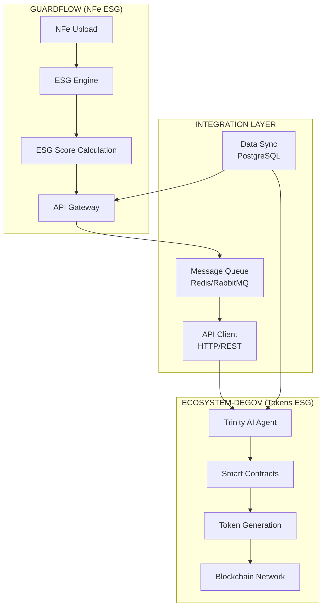
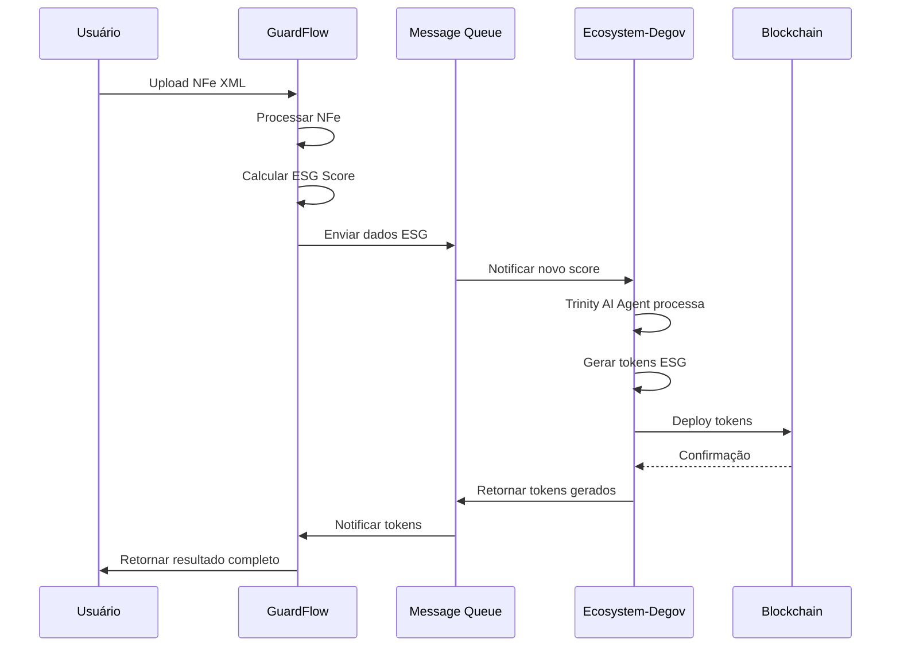
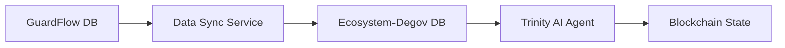
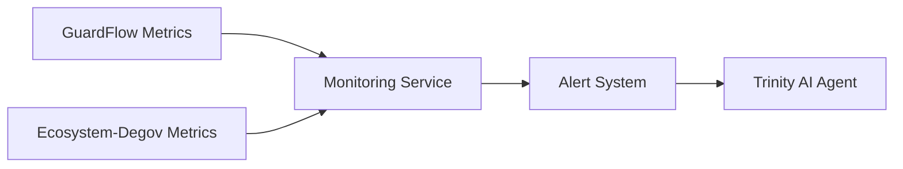

# 🔗 **ARQUITETURA DE INTEGRAÇÃO: GUARDFLOW ↔ ECOSYSTEM-DEGOV**

## 📋 **VISÃO GERAL DA INTEGRAÇÃO**

### **🎯 Objetivo da Integração**
Criar um **ecossistema ESG completo** que combina:
- **GuardFlow**: Processamento de NFe ESG (B2B)
- **Ecosystem-Degov**: Tokenização ESG (DeFi)
- **Integração**: Monetização de dados ESG via tokens

### **🌟 Visão Estratégica**
Transformar dados ESG de NFe em **tokens digitais** que incentivam práticas sustentáveis, criando um **mercado ESG tokenizado** com múltiplas fontes de receita.

---

## 🏗️ **ARQUITETURA DE INTEGRAÇÃO**

### **📊 Diagrama de Alto Nível**



### **🔧 Componentes da Integração**

#### **1. GuardFlow (Sistema Origem)**
- **Função**: Processa NFe e calcula scores ESG
- **Tecnologia**: FastAPI + PostgreSQL + Redis
- **Dados**: NFe XML, scores ESG, metadados fiscais

#### **2. Ecosystem-Degov (Sistema Destino)**
- **Função**: Tokeniza dados ESG em blockchain
- **Tecnologia**: Rust + Solidity + Trinity AI Agent
- **Dados**: Tokens ESG, NFTs, transações blockchain

#### **3. Camada de Integração**
- **Message Queue**: Redis/RabbitMQ para comunicação assíncrona
- **API Client**: Cliente HTTP para comunicação síncrona
- **Data Sync**: Sincronização de dados entre sistemas

---

## 🔄 **FLUXOS DE INTEGRAÇÃO**

### **📈 Fluxo Principal: NFe → ESG Score → Tokens**



### **🔄 Fluxos Secundários**

#### **A. Sincronização de Dados**


#### **B. Monitoramento e Alertas**


---

## 🔌 **APIs DE INTEGRAÇÃO**

### **📤 GuardFlow → Ecosystem-Degov**

#### **Endpoint: Processar Dados ESG**
```http
POST /api/v1/ecosystem-degov/process-esg-data
Content-Type: application/json
Authorization: Bearer {token}

{
    "nfe_id": "12345678901234567890123456789012345678901234",
    "chave_acesso": "35240114200166000187550010000000071234567890",
    "esg_score": {
        "overall": 85.5,
        "environmental": 90.0,
        "social": 80.0,
        "governance": 86.5
    },
    "ncm_codes": ["84000000", "01000000", "22030000"],
    "valor_total": 1500.00,
    "emitente": {
        "cnpj": "14200166000187",
        "razao_social": "Empresa Exemplo LTDA"
    },
    "destinatario": {
        "cnpj": "12345678000195",
        "razao_social": "Cliente Exemplo LTDA"
    },
    "timestamp": "2024-10-15T10:30:00Z"
}
```

#### **Resposta Esperada:**
```json
{
    "success": true,
    "transaction_id": "tx_123456789",
    "tokens_generated": {
        "gst_tokens": 150.0,
        "ect_tokens": 75.0,
        "aet_tokens": 30.0
    },
    "nft_metadata": {
        "nft_id": "NFT-123456789",
        "token_uri": "https://api.ecosystem-degov.com/nft/123456789",
        "transaction_hash": "0x1234567890abcdef..."
    },
    "blockchain_status": "confirmed",
    "timestamp": "2024-10-15T10:31:00Z"
}
```

### **📥 Ecosystem-Degov → GuardFlow**

#### **Endpoint: Status de Tokens**
```http
GET /api/v1/ecosystem-degov/token-status/{nfe_id}
Authorization: Bearer {token}
```

#### **Resposta:**
```json
{
    "nfe_id": "12345678901234567890123456789012345678901234",
    "token_status": "active",
    "tokens_balance": {
        "gst_tokens": 150.0,
        "ect_tokens": 75.0,
        "aet_tokens": 30.0
    },
    "nft_status": "minted",
    "blockchain_confirmations": 12,
    "last_updated": "2024-10-15T10:31:00Z"
}
```

---

## 🗄️ **MODELOS DE DADOS**

### **📊 Schema de Integração**

#### **Tabela: `esg_integration_logs`**
```sql
CREATE TABLE esg_integration_logs (
    id UUID PRIMARY KEY DEFAULT gen_random_uuid(),
    nfe_id VARCHAR(44) NOT NULL,
    chave_acesso VARCHAR(44) NOT NULL,
    esg_score_overall DECIMAL(5,2) NOT NULL,
    esg_score_environmental DECIMAL(5,2) NOT NULL,
    esg_score_social DECIMAL(5,2) NOT NULL,
    esg_score_governance DECIMAL(5,2) NOT NULL,
    valor_total DECIMAL(15,2) NOT NULL,
    ncm_codes TEXT[] NOT NULL,
    transaction_id VARCHAR(100),
    tokens_generated JSONB,
    nft_metadata JSONB,
    blockchain_status VARCHAR(50),
    integration_status VARCHAR(50) NOT NULL,
    created_at TIMESTAMP WITH TIME ZONE DEFAULT NOW(),
    updated_at TIMESTAMP WITH TIME ZONE DEFAULT NOW()
);
```

#### **Tabela: `token_transactions`**
```sql
CREATE TABLE token_transactions (
    id UUID PRIMARY KEY DEFAULT gen_random_uuid(),
    nfe_id VARCHAR(44) NOT NULL,
    transaction_hash VARCHAR(66),
    token_type VARCHAR(20) NOT NULL,
    amount DECIMAL(18,8) NOT NULL,
    recipient_address VARCHAR(42),
    block_number BIGINT,
    gas_used BIGINT,
    gas_price BIGINT,
    status VARCHAR(50) NOT NULL,
    created_at TIMESTAMP WITH TIME ZONE DEFAULT NOW()
);
```

---

## ⚙️ **CONFIGURAÇÕES DE INTEGRAÇÃO**

### **🔧 Variáveis de Ambiente**

#### **GuardFlow (.env)**
```bash
# Ecosystem-Degov Integration
ECOSYSTEM_DEGOV_API_URL=http://localhost:8080
ECOSYSTEM_DEGOV_API_KEY=your_api_key_here
ECOSYSTEM_DEGOV_WEBHOOK_SECRET=your_webhook_secret

# Message Queue
REDIS_URL=redis://localhost:6379/1
RABBITMQ_URL=amqp://localhost:5672

# Integration Settings
INTEGRATION_ENABLED=true
INTEGRATION_RETRY_ATTEMPTS=3
INTEGRATION_TIMEOUT=30
```

#### **Ecosystem-Degov (.env)**
```bash
# GuardFlow Integration
GUARDFLOW_API_URL=http://localhost:8000
GUARDFLOW_API_KEY=your_guardflow_api_key
GUARDFLOW_WEBHOOK_SECRET=your_webhook_secret

# Blockchain Settings
ETHEREUM_RPC_URL=https://mainnet.infura.io/v3/your_project_id
PRIVATE_KEY=your_private_key
CONTRACT_ADDRESS=0x1234567890abcdef...

# Trinity AI Agent
TRINITY_AI_ENABLED=true
TRINITY_AI_MODEL_PATH=/path/to/model
```

### **📋 Configuração de Serviços**

#### **Docker Compose (Integração)**
```yaml
version: '3.8'

services:
  # GuardFlow
  guardflow:
    build: ./guardflow
    ports:
      - "8000:8000"
    environment:
      - ECOSYSTEM_DEGOV_API_URL=http://ecosystem-degov:8080
      - REDIS_URL=redis://redis:6379/1
    depends_on:
      - redis
      - postgres

  # Ecosystem-Degov
  ecosystem-degov:
    build: ./ecosystem-degov
    ports:
      - "8080:8080"
    environment:
      - GUARDFLOW_API_URL=http://guardflow:8000
      - REDIS_URL=redis://redis:6379/2
    depends_on:
      - redis
      - postgres

  # Message Queue
  redis:
    image: redis:7-alpine
    ports:
      - "6379:6379"
    volumes:
      - redis_data:/data

  # Database
  postgres:
    image: postgres:15
    environment:
      - POSTGRES_DB=integration_db
      - POSTGRES_USER=integration_user
      - POSTGRES_PASSWORD=integration_pass
    volumes:
      - postgres_data:/var/lib/postgresql/data

volumes:
  redis_data:
  postgres_data:
```

---

## 🚀 **IMPLEMENTAÇÃO**

### **📋 Fase 1: Preparação (1 semana)**

#### **1.1 Análise de APIs**
- [ ] Mapear endpoints do GuardFlow
- [ ] Mapear endpoints do Ecosystem-Degov
- [ ] Definir contratos de integração
- [ ] Criar documentação de APIs

#### **1.2 Configuração de Ambiente**
- [ ] Configurar variáveis de ambiente
- [ ] Configurar Docker Compose
- [ ] Configurar banco de dados
- [ ] Configurar message queue

### **📋 Fase 2: Integração Básica (2 semanas)**

#### **2.1 Implementação no GuardFlow**
```python
# backend/app/services/ecosystem_degov_client.py
import httpx
import asyncio
from typing import Dict, Any, Optional
from app.config import settings

class EcosystemDegovClient:
    def __init__(self):
        self.base_url = settings.ECOSYSTEM_DEGOV_API_URL
        self.api_key = settings.ECOSYSTEM_DEGOV_API_KEY
        self.timeout = settings.INTEGRATION_TIMEOUT
    
    async def process_esg_data(self, esg_data: Dict[str, Any]) -> Dict[str, Any]:
        """Envia dados ESG para tokenização"""
        async with httpx.AsyncClient(timeout=self.timeout) as client:
            response = await client.post(
                f"{self.base_url}/api/v1/ecosystem-degov/process-esg-data",
                json=esg_data,
                headers={"Authorization": f"Bearer {self.api_key}"}
            )
            response.raise_for_status()
            return response.json()
    
    async def get_token_status(self, nfe_id: str) -> Dict[str, Any]:
        """Consulta status dos tokens gerados"""
        async with httpx.AsyncClient(timeout=self.timeout) as client:
            response = await client.get(
                f"{self.base_url}/api/v1/ecosystem-degov/token-status/{nfe_id}",
                headers={"Authorization": f"Bearer {self.api_key}"}
            )
            response.raise_for_status()
            return response.json()
```

#### **2.2 Implementação no Ecosystem-Degov**
```rust
// src/api/guardflow_integration.rs
use axum::{extract::Path, http::StatusCode, Json};
use serde::{Deserialize, Serialize};

#[derive(Deserialize)]
pub struct ESGData {
    pub nfe_id: String,
    pub chave_acesso: String,
    pub esg_score: ESGScore,
    pub ncm_codes: Vec<String>,
    pub valor_total: f64,
    pub emitente: Emitente,
    pub destinatario: Destinatario,
    pub timestamp: String,
}

#[derive(Deserialize)]
pub struct ESGScore {
    pub overall: f64,
    pub environmental: f64,
    pub social: f64,
    pub governance: f64,
}

pub async fn process_esg_data(
    Json(esg_data): Json<ESGData>
) -> Result<Json<TokenResponse>, StatusCode> {
    // Processar dados ESG com Trinity AI Agent
    let trinity_agent = TrinityAIAgent::new();
    let result = trinity_agent.process_esg_data(esg_data).await?;
    
    Ok(Json(result))
}

pub async fn get_token_status(
    Path(nfe_id): Path<String>
) -> Result<Json<TokenStatus>, StatusCode> {
    // Consultar status dos tokens
    let status = get_token_status_from_blockchain(&nfe_id).await?;
    Ok(Json(status))
}
```

### **📋 Fase 3: Testes e Validação (1 semana)**

#### **3.1 Testes de Integração**
```python
# backend/tests/test_integration.py
import pytest
from app.services.ecosystem_degov_client import EcosystemDegovClient

@pytest.mark.asyncio
async def test_process_esg_data():
    client = EcosystemDegovClient()
    esg_data = {
        "nfe_id": "test_nfe_123",
        "esg_score": {"overall": 85.5, "environmental": 90.0, "social": 80.0, "governance": 86.5},
        "valor_total": 1500.00,
        "ncm_codes": ["84000000"]
    }
    
    result = await client.process_esg_data(esg_data)
    assert result["success"] is True
    assert "tokens_generated" in result
    assert "nft_metadata" in result
```

#### **3.2 Testes End-to-End**
```python
# tests/e2e/test_full_integration.py
@pytest.mark.asyncio
async def test_full_nfe_to_tokens_flow():
    # 1. Upload NFe
    nfe_response = await upload_nfe("test_nfe.xml")
    assert nfe_response.status_code == 200
    
    # 2. Verificar processamento ESG
    esg_response = await get_esg_score(nfe_response.json()["nfe_id"])
    assert esg_response.status_code == 200
    
    # 3. Verificar tokenização
    token_response = await get_token_status(nfe_response.json()["nfe_id"])
    assert token_response.status_code == 200
    assert "tokens_generated" in token_response.json()
```

---

## 📊 **MONITORAMENTO E OBSERVABILIDADE**

### **🔍 Métricas de Integração**

#### **Métricas do GuardFlow**
- `integration_requests_total`: Total de requisições de integração
- `integration_success_rate`: Taxa de sucesso da integração
- `integration_latency_seconds`: Latência da integração
- `esg_scores_processed_total`: Total de scores ESG processados

#### **Métricas do Ecosystem-Degov**
- `tokens_generated_total`: Total de tokens gerados
- `nft_minted_total`: Total de NFTs criados
- `blockchain_transactions_total`: Total de transações blockchain
- `trinity_ai_processing_time_seconds`: Tempo de processamento do Trinity AI

### **📈 Dashboards**

#### **Dashboard de Integração**
```yaml
# grafana/dashboards/integration.json
{
  "dashboard": {
    "title": "GuardFlow ↔ Ecosystem-Degov Integration",
    "panels": [
      {
        "title": "Integration Success Rate",
        "type": "stat",
        "targets": [
          {
            "expr": "rate(integration_requests_total{status=\"success\"}[5m]) / rate(integration_requests_total[5m]) * 100"
          }
        ]
      },
      {
        "title": "Tokens Generated",
        "type": "graph",
        "targets": [
          {
            "expr": "rate(tokens_generated_total[5m])"
          }
        ]
      }
    ]
  }
}
```

---

## 🛡️ **SEGURANÇA E COMPLIANCE**

### **🔐 Autenticação e Autorização**

#### **API Keys**
```python
# GuardFlow
ECOSYSTEM_DEGOV_API_KEY=sk_guardflow_1234567890abcdef

# Ecosystem-Degov
GUARDFLOW_API_KEY=sk_ecosystem_degov_1234567890abcdef
```

#### **Webhook Security**
```python
# Verificação de webhook
import hmac
import hashlib

def verify_webhook_signature(payload: bytes, signature: str, secret: str) -> bool:
    expected_signature = hmac.new(
        secret.encode(),
        payload,
        hashlib.sha256
    ).hexdigest()
    return hmac.compare_digest(signature, expected_signature)
```

### **📋 Compliance**

#### **LGPD Compliance**
- **Anonimização**: Dados pessoais são anonimizados antes da integração
- **Consentimento**: Usuário deve consentir com a tokenização
- **Retenção**: Dados são retidos conforme política de LGPD

#### **SEFAZ Compliance**
- **Não Interferência**: Integração não altera NFe original
- **Auditoria**: Logs completos de todas as operações
- **Validação**: NFe deve estar autorizada pela SEFAZ

---

## 🚀 **ROADMAP DE EVOLUÇÃO**

### **📅 Cronograma de Implementação**

#### **Semana 1-2: Preparação**
- [ ] Análise de APIs
- [ ] Configuração de ambiente
- [ ] Documentação de integração

#### **Semana 3-4: Implementação Básica**
- [ ] Cliente de integração no GuardFlow
- [ ] Endpoints de integração no Ecosystem-Degov
- [ ] Testes unitários

#### **Semana 5-6: Testes e Validação**
- [ ] Testes de integração
- [ ] Testes end-to-end
- [ ] Validação de performance

#### **Semana 7-8: Produção**
- [ ] Deploy em ambiente de produção
- [ ] Monitoramento e alertas
- [ ] Documentação final

### **🎯 Funcionalidades Futuras**

#### **Fase 2: Integração Avançada**
- [ ] **Real-time Sync**: Sincronização em tempo real
- [ ] **Batch Processing**: Processamento em lote
- [ ] **Advanced Analytics**: Analytics avançados

#### **Fase 3: Ecossistema Completo**
- [ ] **Multi-chain Support**: Suporte a múltiplas blockchains
- [ ] **AI Optimization**: Otimização com IA
- [ ] **Marketplace Integration**: Integração com marketplaces

---

## 📞 **SUPORTE E MANUTENÇÃO**

### **🔧 Troubleshooting**

#### **Problemas Comuns**
1. **Timeout de Integração**
   - Verificar conectividade de rede
   - Ajustar timeout nas configurações
   - Verificar carga dos serviços

2. **Falha na Tokenização**
   - Verificar saldo de gas
   - Verificar status da blockchain
   - Verificar logs do Trinity AI Agent

3. **Sincronização de Dados**
   - Verificar status do message queue
   - Verificar logs de sincronização
   - Executar sincronização manual

### **📋 Checklist de Manutenção**

#### **Diário**
- [ ] Verificar status dos serviços
- [ ] Verificar métricas de integração
- [ ] Verificar logs de erro

#### **Semanal**
- [ ] Análise de performance
- [ ] Backup de dados
- [ ] Atualização de dependências

#### **Mensal**
- [ ] Auditoria de segurança
- [ ] Análise de custos
- [ ] Planejamento de melhorias

---

## 📚 **REFERÊNCIAS E DOCUMENTAÇÃO**

### **🔗 Links Úteis**
- [GuardFlow API Documentation](./api/README.md)
- [Ecosystem-Degov API Documentation](../ecosystem-degov/docs/api/README.md)
- [Trinity AI Agent Documentation](../ecosystem-degov/docs/trinity/README.md)
- [Blockchain Integration Guide](./blockchain/README.md)

### **📖 Documentação Técnica**
- [Arquitetura de Microserviços](./microservices/README.md)
- [Padrões de Integração](./patterns/README.md)
- [Monitoramento e Observabilidade](./monitoring/README.md)
- [Segurança e Compliance](./security/README.md)

---

*Última atualização: 16 de Outubro de 2025*
*Versão: 1.0.0*
*Autor: GuardFlow Development Team*
