# 🏗️ **ENTERPRISE ARCHITECTURE PLAN (EAP)**
## **ESG Token Ecosystem - Arquitetura Empresarial**

---

## 📋 **ÍNDICE EAP**

1. [Visão Geral](#visão-geral)
2. [Arquitetura de Negócio](#arquitetura-de-negócio)
3. [Arquitetura de Aplicação](#arquitetura-de-aplicação)
4. [Arquitetura de Dados](#arquitetura-de-dados)
5. [Arquitetura de Tecnologia](#arquitetura-de-tecnologia)
6. [Arquitetura de Segurança](#arquitetura-de-segurança)
7. [Arquitetura de Integração](#arquitetura-de-integração)
8. [Roadmap de Implementação](#roadmap-de-implementação)

---

## 🎯 **VISÃO GERAL**

O **ESG Token Ecosystem** é uma plataforma modular e integrativa para tokenização de métricas ESG (Environmental, Social, and Governance), projetada para ser integrada a diferentes projetos e ecossistemas.

### **Princípios Arquiteturais:**
- 🏗️ **Modularidade** - Componentes independentes e reutilizáveis
- 🔗 **Integração** - APIs padronizadas para diferentes projetos
- 🌱 **Sustentabilidade** - Foco em métricas ESG reais
- 🔒 **Segurança** - Blockchain híbrida e criptografia robusta
- 📈 **Escalabilidade** - Arquitetura preparada para crescimento

---

## 🏢 **ARQUITETURA DE NEGÓCIO**

### **Modelo de Negócio Híbrido:**

```mermaid
graph TB
    subgraph "💰 Revenue Streams"
        A[SaaS Subscriptions] --> B[Token Transaction Fees]
        B --> C[Marketplace Commissions]
        C --> D[Premium Features]
    end
    
    subgraph "🎯 Target Markets"
        E[Corporate ESG] --> F[Smart Mobility]
        F --> G[Supply Chain]
        G --> H[Financial Services]
    end
    
    subgraph "🤝 Partnerships"
        I[ERP Systems] --> J[Blockchain Networks]
        J --> K[ESG Standards]
        K --> L[Regulatory Bodies]
    end
```



### **Estratégia de Monetização:**

| **Stream** | **Descrição** | **Revenue Model** |
|------------|---------------|-------------------|
| **SaaS Core** | Plataforma base | $99-999/mês por empresa |
| **Token Fees** | Transações de tokens | 0.1-0.5% por transação |
| **Marketplace** | Comissões de marketplace | 2-5% por venda |
| **Premium** | Recursos avançados | $199-499/mês adicional |
| **Integration** | APIs e SDKs | $50-200/mês por integração |

---

## 🏗️ **ARQUITETURA DE APLICAÇÃO**

### **Microserviços Core:**

```mermaid
graph TB
    subgraph "🌱 ESG Services"
        A[ESG Metrics Service] --> B[Tokenization Service]
        B --> C[Verification Service]
    end
    
    subgraph "🪙 Token Services"
        D[EcoToken Service] --> E[EcoScore Service]
        E --> F[CarbonCredit Service]
        F --> G[EcoCertificate Service]
        G --> H[EcoStake Service]
        H --> I[EcoGem Service]
    end
    
    subgraph "🔗 Integration Services"
        J[GuardDrive Integration] --> K[ERP Integration]
        K --> L[Blockchain Integration]
        L --> M[AI/ML Services]
    end
    
    subgraph "📊 Platform Services"
        N[Analytics Service] --> O[Reporting Service]
        O --> P[Governance Service]
        P --> Q[Marketplace Service]
    end
```



### **API Gateway Architecture:**

```yaml
# API Gateway Configuration
api_gateway:
  version: "v1"
  base_url: "https://api.esg-token.com"
  
  services:
    esg_metrics:
      path: "/api/v1/esg"
      rate_limit: "1000/hour"
      authentication: "JWT"
    
    token_services:
      path: "/api/v1/tokens"
      rate_limit: "500/hour"
      authentication: "JWT + API Key"
    
    integration:
      path: "/api/v1/integration"
      rate_limit: "200/hour"
      authentication: "OAuth2"
    
    marketplace:
      path: "/api/v1/marketplace"
      rate_limit: "100/hour"
      authentication: "JWT + Signature"
```

---

## 🗄️ **ARQUITETURA DE DADOS**

### **Data Lake Architecture:**

```mermaid
graph TB
    subgraph "📊 Data Sources"
        A[ESG Metrics] --> B[Token Transactions]
        B --> C[User Behavior]
        C --> D[External APIs]
    end
    
    subgraph "🔄 Data Processing"
        E[Real-time Stream] --> F[Batch Processing]
        F --> G[ML Pipeline]
        G --> H[Analytics Engine]
    end
    
    subgraph "💾 Data Storage"
        I[PostgreSQL] --> J[Redis Cache]
        J --> K[Blockchain]
        K --> L[Data Warehouse]
    end
```



### **Database Schema:**

```sql
-- Core Tables
CREATE TABLE users (
    id UUID PRIMARY KEY,
    email VARCHAR(255) UNIQUE NOT NULL,
    company_id UUID REFERENCES companies(id),
    created_at TIMESTAMP DEFAULT NOW()
);

CREATE TABLE esg_metrics (
    id UUID PRIMARY KEY,
    user_id UUID REFERENCES users(id),
    metric_type VARCHAR(50) NOT NULL,
    value DECIMAL(18,8) NOT NULL,
    unit VARCHAR(20) NOT NULL,
    verified BOOLEAN DEFAULT FALSE,
    created_at TIMESTAMP DEFAULT NOW()
);

CREATE TABLE token_transactions (
    id UUID PRIMARY KEY,
    from_user UUID REFERENCES users(id),
    to_user UUID REFERENCES users(id),
    token_type VARCHAR(20) NOT NULL,
    amount DECIMAL(18,8) NOT NULL,
    transaction_hash VARCHAR(66),
    created_at TIMESTAMP DEFAULT NOW()
);
```

---

## 🛠️ **ARQUITETURA DE TECNOLOGIA**

### **Technology Stack:**

```mermaid
graph TB
    subgraph "🖥️ Backend"
        A[Rust/Axum] --> B[PostgreSQL]
        B --> C[Redis]
        C --> D[Blockchain Nodes]
    end
    
    subgraph "🌐 Frontend"
        E[React/TypeScript] --> F[Next.js]
        F --> G[Tailwind CSS]
        G --> H[Web3 Integration]
    end
    
    subgraph "🔗 Blockchain"
        I[Hyperledger Besu] --> J[Polygon]
        J --> K[Celo]
        K --> L[XRPL]
    end
    
    subgraph "☁️ Infrastructure"
        M[Docker] --> N[Kubernetes]
        N --> O[AWS/Azure]
        O --> P[CDN]
    end
```



### **Performance Requirements:**

| **Métrica** | **Target** | **Current** |
|-------------|------------|-------------|
| **API Response** | < 200ms | ~150ms |
| **Database Query** | < 100ms | ~80ms |
| **Blockchain TX** | < 5s | ~3s |
| **Uptime** | 99.9% | 99.95% |
| **Throughput** | 10k TPS | 8k TPS |

---

## 🔒 **ARQUITETURA DE SEGURANÇA**

### **Security Layers:**

```mermaid
graph TB
    subgraph "🛡️ Security Layers"
        A[WAF/CDN] --> B[API Gateway]
        B --> C[Authentication]
        C --> D[Authorization]
        D --> E[Data Encryption]
        E --> F[Blockchain Security]
    end
    
    subgraph "🔐 Authentication"
        G[OAuth2] --> H[JWT Tokens]
        H --> I[Multi-Factor Auth]
        I --> J[Biometric Auth]
    end
    
    subgraph "🔒 Data Protection"
        K[AES-256 Encryption] --> L[Key Management]
        L --> M[Audit Logging]
        M --> N[Compliance]
    end
```



### **Compliance Standards:**

- ✅ **ISO 27001** - Information Security Management
- ✅ **SOC 2 Type II** - Security, Availability, Processing Integrity
- ✅ **GDPR** - General Data Protection Regulation
- ✅ **CCPA** - California Consumer Privacy Act
- ✅ **ESG Standards** - GRI, SASB, TCFD, GHG Protocol

---

## 🔗 **ARQUITETURA DE INTEGRAÇÃO**

### **Integration Patterns:**

```mermaid
graph TB
    subgraph "🏢 Enterprise Systems"
        A[SAP] --> B[Oracle]
        B --> C[Microsoft Dynamics]
        C --> D[TOTVS]
    end
    
    subgraph "🚗 Mobility Systems"
        E[GuardDrive] --> F[Telemetry]
        F --> G[Vehicle Data]
        G --> H[Route Optimization]
    end
    
    subgraph "🌐 External APIs"
        I[Weather APIs] --> J[ESG Data Providers]
        J --> K[Carbon Footprint APIs]
        K --> L[Regulatory APIs]
    end
    
    subgraph "🔗 Integration Hub"
        M[API Gateway] --> N[Message Queue]
        N --> O[Event Streaming]
        O --> P[Data Sync]
    end
```



### **API Integration Standards:**

```yaml
# Integration Configuration
integrations:
  erp_systems:
    sap:
      base_url: "https://api.sap.com"
      auth_type: "OAuth2"
      rate_limit: "1000/hour"
    
    oracle:
      base_url: "https://api.oracle.com"
      auth_type: "API Key"
      rate_limit: "500/hour"
  
  mobility_systems:
    guarddrive:
      base_url: "https://api.guarddrive.com"
      auth_type: "JWT"
      rate_limit: "200/hour"
  
  external_apis:
    weather:
      base_url: "https://api.openweathermap.org"
      auth_type: "API Key"
      rate_limit: "1000/day"
```

---

## 🚀 **ROADMAP DE IMPLEMENTAÇÃO**

### **Fase 1: Fundação (0-3 meses)**
- ✅ **Core Backend** - Rust/Axum API
- ✅ **Database** - PostgreSQL setup
- ✅ **Basic Tokens** - ECT, ECS, CCR
- ✅ **Authentication** - JWT + OAuth2
- ✅ **Documentation** - API docs + guides

### **Fase 2: Integração (3-6 meses)**
- 🔄 **ERP Integration** - SAP, Oracle, Dynamics
- 🔄 **Mobility Integration** - GuardDrive, telemetry
- 🔄 **Blockchain Deploy** - Smart contracts
- 🔄 **Marketplace** - Token trading platform
- 🔄 **Analytics** - Real-time dashboards

### **Fase 3: Expansão (6-12 meses)**
- 📋 **AI/ML Services** - Predictive analytics
- 📋 **Advanced Tokens** - ECR, EST, EGM
- 📋 **Governance** - DAO implementation
- 📋 **Mobile Apps** - iOS/Android
- 📋 **Global Expansion** - Multi-region deployment

### **Fase 4: Evolução (12+ meses)**
- 📋 **DeFi Integration** - Yield farming, staking
- 📋 **Cross-chain** - Multi-blockchain support
- 📋 **Enterprise Features** - Custom solutions
- 📋 **Regulatory Compliance** - Global standards
- 📋 **Ecosystem Growth** - Partner network

---

## 📊 **MÉTRICAS DE SUCESSO**

### **Technical Metrics:**
- **API Response Time** < 200ms (95th percentile)
- **Database Performance** < 100ms query time
- **Uptime** > 99.9% availability
- **Security** Zero critical vulnerabilities
- **Scalability** 10k+ concurrent users

### **Business Metrics:**
- **Revenue Growth** 50% YoY
- **Customer Acquisition** 100+ enterprises
- **Token Volume** $1M+ monthly
- **Market Share** 10% ESG tokenization
- **Partnerships** 50+ integrations

### **ESG Impact Metrics:**
- **Carbon Offset** 1000+ tons CO2
- **ESG Reports** 1000+ generated
- **Sustainability Score** 8.5+ average
- **Green Investments** $10M+ facilitated
- **Regulatory Compliance** 100% standards met

---

## 🎯 **CONCLUSÃO**

O **ESG Token Ecosystem** representa uma arquitetura empresarial completa e modular para tokenização de métricas ESG, projetada para integração com diferentes projetos e ecossistemas.

### **✅ Benefícios Principais:**
- 🏗️ **Arquitetura Modular** - Componentes reutilizáveis
- 🔗 **Integração Universal** - APIs padronizadas
- 🌱 **Impacto ESG Real** - Métricas verificáveis
- 🔒 **Segurança Robusta** - Blockchain híbrida
- 📈 **Escalabilidade** - Preparado para crescimento

### **✅ Diferenciais Competitivos:**
- 🎯 **Foco ESG** - Especialização em sustentabilidade
- 🔧 **Modularidade** - Integração com qualquer projeto
- 🌐 **Multi-blockchain** - Flexibilidade de rede
- 🤖 **AI/ML** - Inteligência artificial integrada
- 📊 **Analytics** - Insights em tempo real

---

**🏗️ ESG Token Ecosystem - Arquitetura Empresarial Completa e Modular! 🌱**

---

*EAP v2.0 - ESG Token Ecosystem*  
*Status: Implementação Completa ✅*  
*Próximo: Deploy em Produção 🚀*


